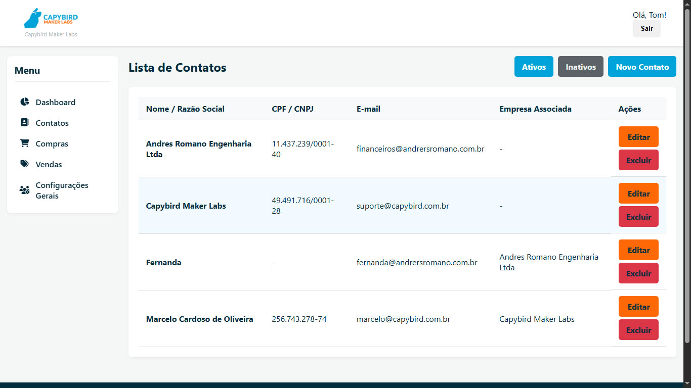

# 🚀 Capy Gestão: Sistema de Gestão Empresarial


Bem-vindo ao **Capy Gestão**, um sistema de gestão empresarial moderno e flexível, construído com o poderoso framework Django. Este projeto foi desenhado para ser uma solução centralizada para o gerenciamento de clientes, contatos, e futuras operações comerciais como vendas e compras.

Com uma interface limpa e intuitiva, o Capy Gestão permite que a empresa administradora gerencie seus próprios clientes (outras organizações) de forma personalizada, incluindo a capacidade de exibir a marca de cada cliente dentro do sistema, criando uma experiência de usuário única e profissional.

---

## ✨ Funcionalidades Principais

*   **Autenticação Segura:** Sistema de login completo baseado na robusta biblioteca de autenticação do Django.
*   **Dashboard Central:** Uma visão geral do sistema com navegação intuitiva através de um menu lateral (sidebar) com ícones.
*   **Gestão de Contatos (CRUD Completo):**
    *   Criação, leitura, atualização e exclusão de contatos.
    *   Diferenciação entre **Pessoa Física (PF)** e **Pessoa Jurídica (PJ)**.
    *   Hierarquia entre contatos: associe contatos PF a uma empresa PJ.
    *   Gerenciamento de múltiplos endereços por contato.
*   **Gerenciamento de Usuários:** Controle de acesso dos usuários que podem operar o sistema.
*   **Personalização de Marca (Branding):**
    *   A empresa que utiliza o sistema (Gestor) pode cadastrar sua própria logomarca.
    *   O logo do gestor é exibido globalmente na barra de navegação, reforçando a identidade da marca.
    *   Cada cliente (Organização) pode ter seu próprio logo exibido em sua página de detalhes.
*   **Estrutura de Projeto Profissional:**
    *   Código desacoplado com CSS, HTML e lógica de negócio bem separados.
    *   Uso de diretórios globais para `templates` e `static` para fácil manutenção.
    *   Utilização de Class-Based Views (CBVs) e Django Forms para um código mais limpo e reutilizável.

---

## 📸 Pré-visualização

<p align="center">
  
  <br>
  <em>Tela de listagem de contatos com filtros e ações rápidas.</em>
</p>

---

## 🛠️ Tecnologias Utilizadas

*   **Backend:** Python 3.12, Django 5.2
*   **Frontend:** HTML5, CSS3 (com Flexbox e Grid para responsividade)
*   **Banco de Dados:** SQLite 3 (para desenvolvimento)
*   **Ícones:** Font Awesome
*   **Dependências Python:** Veja o arquivo `requirements.txt`.

---

## ⚙️ Instalação e Execução

Siga os passos abaixo para rodar o projeto em seu ambiente de desenvolvimento.

### Pré-requisitos

*   Python 3.10 ou superior
*   `pip` (gerenciador de pacotes do Python)

### Passos

1.  **Clone o repositório:**
    ```bash
    git clone https://github.com/seu-usuario/capy.git
    cd capy
    ```

2.  **Crie e ative um ambiente virtual:**
    *   No Windows:
        ```bash
        python -m venv .venv
        .venv\Scripts\activate
        ```
    *   No macOS/Linux:
        ```bash
        python3 -m venv .venv
        source .venv/bin/activate
        ```

3.  **Instale as dependências:**
    ```bash
    pip install -r requirements.txt
    ```

4.  **Aplique as migrações do banco de dados:**
    ```bash
    python manage.py migrate
    ```

5.  **Crie um superusuário** para acessar a área administrativa e o sistema:
    ```bash
    python manage.py createsuperuser
    ```
    (Siga as instruções para criar seu nome de usuário, e-mail e senha.)

6.  **Inicie o servidor de desenvolvimento:**
    ```bash
    python manage.py runserver
    ```

7.  **Acesse o sistema!**
    *   Abra seu navegador e acesse: `http://127.0.0.1:8000/`
    *   Faça login com as credenciais do superusuário que você acabou de criar.

---

## 🚀 Próximos Passos e Melhorias

O Capy Gestão é um projeto em constante evolução. Os próximos passos planejados incluem:

*   [ ] Implementação dos módulos de **Compras** e **Vendas**.
*   [ ] Criação de um dashboard com **KPIs e gráficos** interativos.
*   [ ] Validação de documentos (CPF/CNPJ) no backend.
*   [ ] Testes automatizados para garantir a estabilidade do código.
*   [ ] Implantação em um ambiente de produção (usando Gunicorn, Nginx, etc.).

Essas tasks já estão na seção ISSUES aqui no projeto, sinta-se à vontade para contribuir

---

## 🤝 Contribuição

Contribuições são sempre bem-vindas! Se você tem ideias para melhorar o projeto, sinta-se à vontade para abrir uma *issue* ou enviar um *pull request*.

---

Desenvolvido com ❤️ por [Marcelo Cardoso](https://github.com/marceloc4rdoso).
